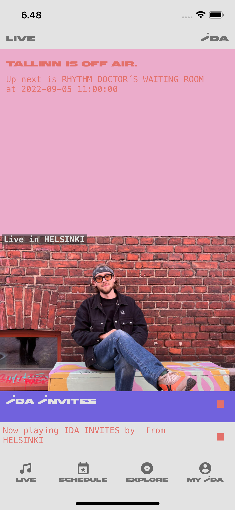
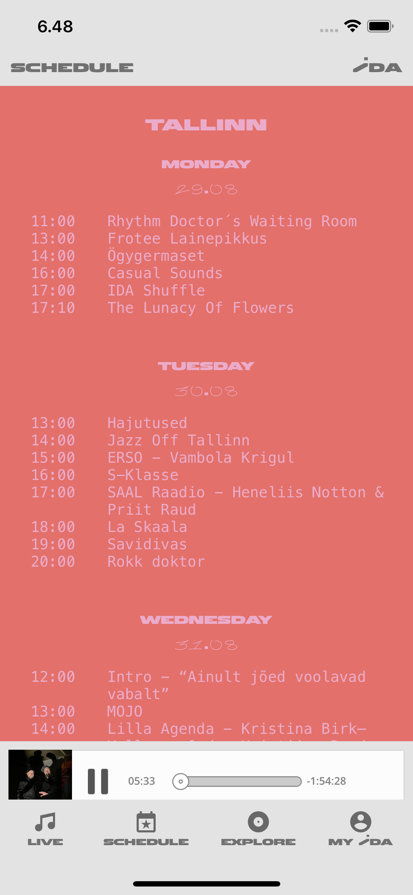
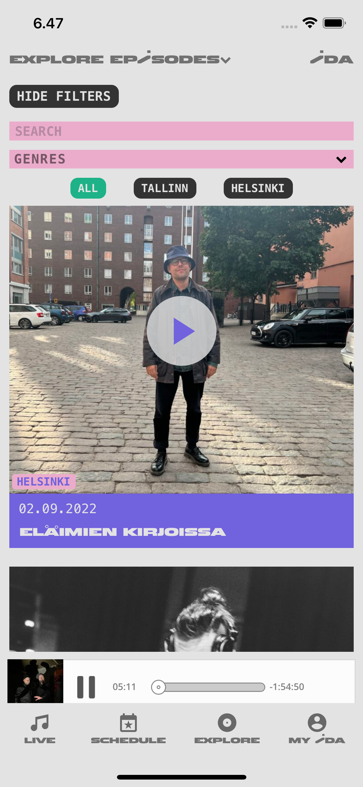

# IDA Radio fan app
A React Native mobile app for [IDA Radio](https://idaidaida.net/) written in TypeScript. This is an unofficial, fan-made project, with the goal of teaching myself React Native and hopefully making a nice mobile app for IDA Radio in the process. IDA is an online community radio based in Tallinn & Helsinki, [and they would appreciate any support](https://idaidaida.net/about-us).

## Table of contents

1. [Usage & Design](#usagedesign)
   - [Live view](#liveview)
   - [Schedule view](#scheduleview)
   - [Explore view](#exploreview)
   - [My IDA](#myidaview)
2. [Data Fetching](#datafetching)
3. [Live Stream & On-Demand](#liveondemand)
4. [Prerequisites](#prerequisites)
5. [Getting Started](#prerequisites)
6. [Testing, Development And Deployment](#testdeploy)

## Usage & Design 

The app aims to mimic the design of the mobile version of the Ida Radio website. Other features are heavily inspired by the excellent NTS Live application.

### Live view 

The live view shows the currently airing shows in Tallinn and Helsinki. If the studios are offline, the next program is shown. Pressing the play icon starts the audio streams and displays the now playing bar at the bottom of the view, above the navigation bar.

### Schedule view

The schedule view displays the current week's program schedule. Pressing on a shows name takes the user to the shows own view, where a description and latest episodes are listed.

### Explore view

A view to explore shows and episodes. By default, the latest shows are displayed and shows are listed alphabetically. The user may filter shows by a search query, by genres or by channel (all/tallinn/helsinki). Pressing the play icon on an episode's card view opens the Mixcloud iframe player for on-demand listening.

### My Ida view

**NOT IMPLEMENTED YET**
My Ida view will host the user's favorite shows, episodes and play history, as well as an about section with information about Ida Radio and the app itself.

## Data Fetching 

The app fetches the data on Ida Radio's programming schedule, shows and episodes from [Ida Radio's website's](https://idaidaida.net/) API. Now playing and programming schedule data are fetched hourly using Fetch API. Lists of shows and episodes are fetched using React Query. Applying search filters alters the fetch query's endpoint accordingly.

## Live stream & On-Demand 

[React Native Track Player](https://react-native-track-player.js.org/) is used to play the live broadcasts from Tallin and Helsinki. On-Demand shows are hosted in [Mixcloud](https://www.mixcloud.com/developers/widget/) and played using an iframe in [React Native Webview](https://github.com/react-native-webview/react-native-webview).

## Prerequisites 

- Follow the [React Native CLI quickstart](https://reactnative.dev/docs/environment-setup) instructions on setting up the development environment relevant to your development OS and target OS.

## Getting started 

- Clone the repository
- Run `npm install` to install dependencies
- For OSX/IOS version, `cd ios` into the ios folder and run `pod install`
- In the root folder run `npx react-native start` to start the develoment server
- Run `npx react-native run-ios` to run the app in an iOS simulator
- Run `npx react-native run-android` to run the app in an Android simulator
- To run the app in a physical device, follow the [instructions in React Native documentation](https://reactnative.dev/docs/running-on-device) relevant to your Development OS and mobile device.

#### Testing, Development and Deployment 

- Run `npm run test` to run tests. Tests written using Jest and React Native Testing Library.
- The project uses Eslint and Prettier to maintain code quality. Pre-commit hook using Husky runs Eslint before commits.
- Github Actions run tests on pull requests to develop and main branches
- For now there is no deployment pipeline in place. In the future Github Actions will be extended to
  - Deploy merges from a feature branch to develop to beta environments.
  - Deploy merges from develop to main branch to production.
